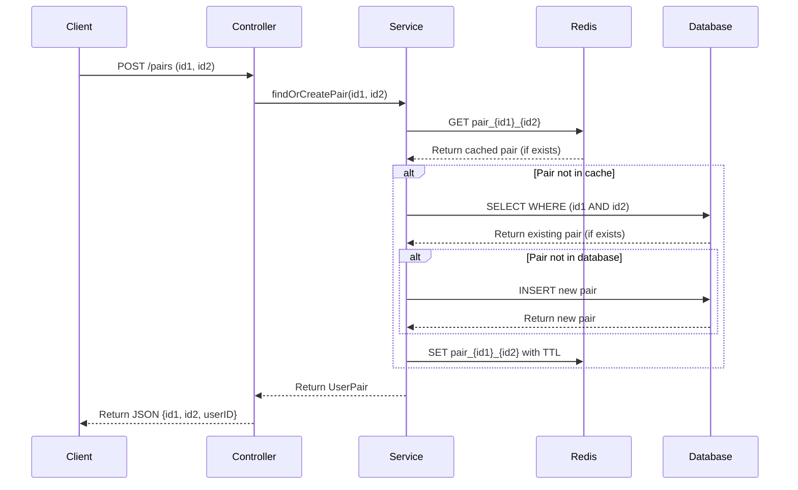

# System Sequence Diagram

## Description of the Flow:

1. The client sends a POST request to /pairs endpoint with id1 and id2 parameters
2. The controller validates the input and forwards the request to the service
3. The service first checks in Redis cache for the pair
4. If found in cache, it returns the cached result
5. If not in cache, it queries the database:
   - Checks if the pair (id1, id2) exists in the user_pairs table (exact match only)
6. If found in database, it caches the result in Redis and returns it
7. If not found in database, it creates a new record with a UUID for userID, saves to database, caches the result, and returns it
8. The controller transforms the result to the required JSON format and returns to the client

This flow ensures efficient lookups using Redis caching while maintaining data consistency with the MySQL database.